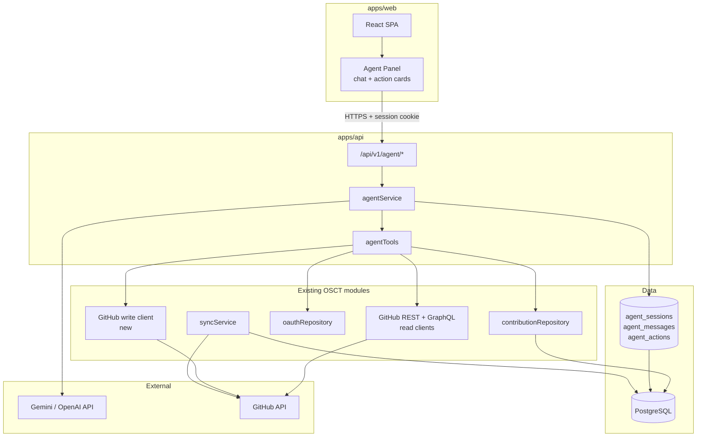
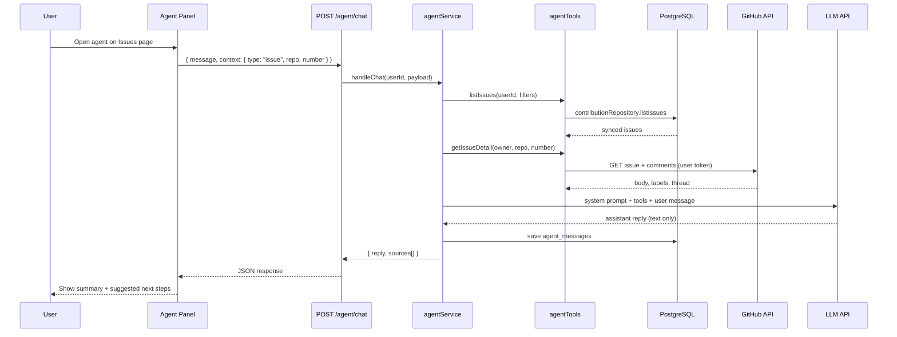
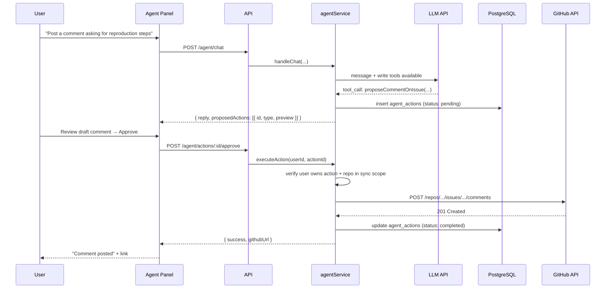
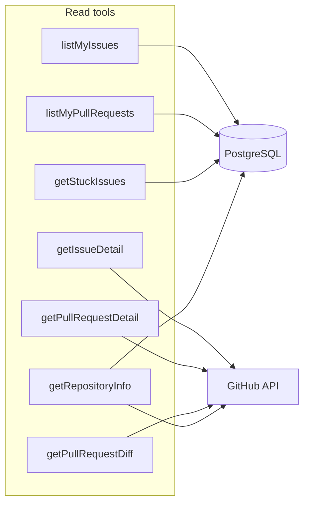
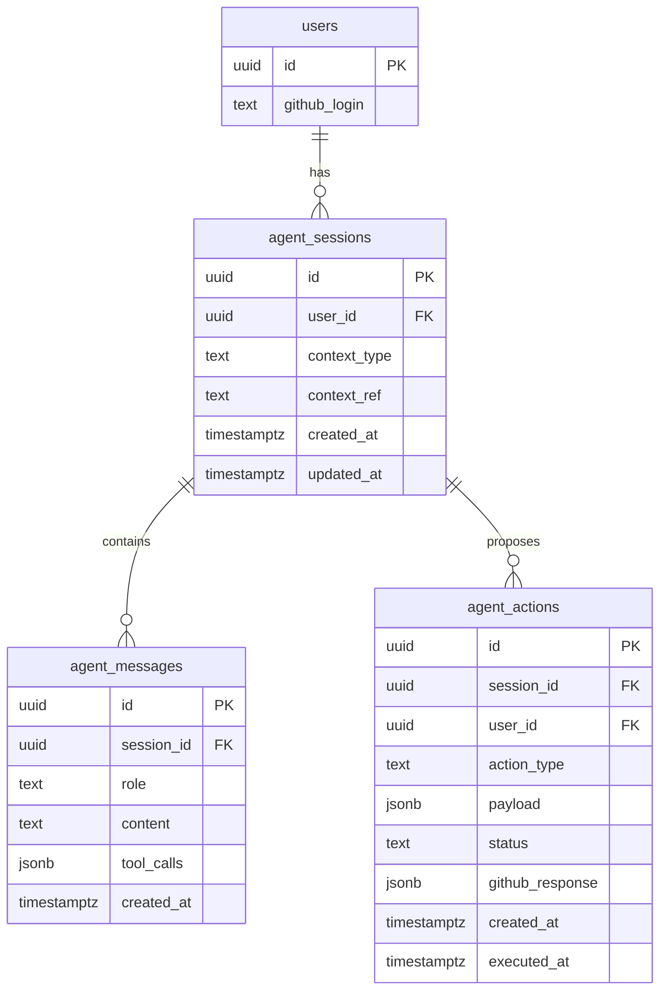
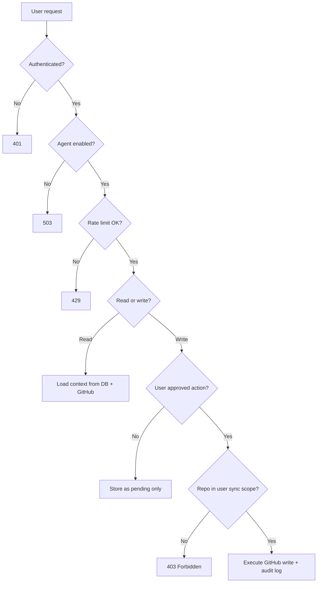
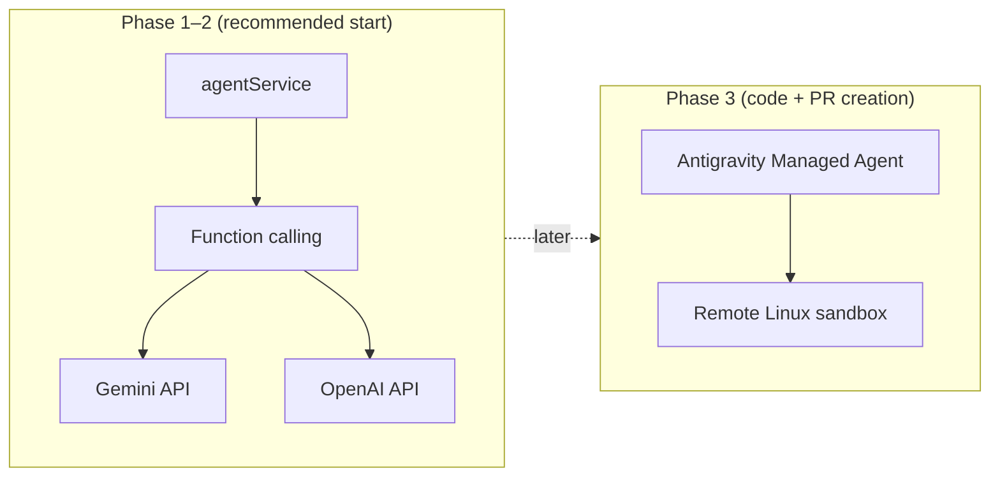
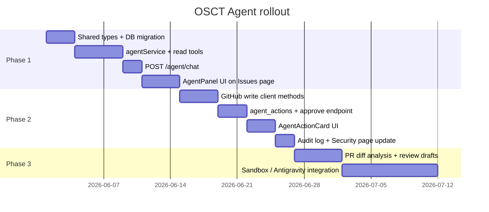

# OSCT AI Agent — Architecture & Implementation Plan

This document describes how the **OSCT Agent** will help users resolve issues and read/write pull requests. It is a planning reference only — nothing here is implemented yet.

**Related docs:** [architecture.md](./architecture.md) · [feature-plan.md](./feature-plan.md)

---

## 1. Goals

| Goal | Description |
|------|-------------|
| **Triage issues** | Explain stuck/open issues, suggest next steps, draft replies |
| **Understand PRs** | Summarize diffs, review status, CI/check context |
| **Act on GitHub** | Post comments, close issues, review PRs — only with explicit user approval |
| **Stay safe** | No silent writes; audit log; scoped to repos the user already synced |

**Out of scope (v1):** fully autonomous merges, force-push, deleting repos, editing other users' code without review.

---

## 2. System Context

How the agent fits into the existing OSCT stack.



**Key principle:** The agent uses **cached DB data first** (fast, cheap), then **live GitHub** when it needs bodies, comments, or diffs. Writes always go through a separate approval step.

---

## 3. Layered Architecture (Backend)

```mermaid
flowchart TB
    subgraph Presentation
        R1[POST /agent/chat]
        R2[POST /agent/actions/:id/approve]
        R3[GET /agent/sessions/:id]
        MW[requireAuth middleware]
    end

    subgraph Application
        AS[agentService<br/>orchestration + LLM loop]
        AT[agentTools<br/>tool definitions + handlers]
        AP[actionPolicy<br/>validate + scope checks]
    end

    subgraph Domain
        AM[AgentMessage]
        AA[AgentAction]
        AC[AgentContext<br/>issue | pr | repo]
    end

    subgraph Infrastructure
        LLMC[llmClient<br/>Gemini / OpenAI]
        GHC[githubWriteClient<br/>new methods in api.ts]
        AR[agentRepository]
        CR[contributionRepository]
        OR[oauthRepository]
    end

    R1 --> MW --> AS
    R2 --> MW --> AS
    AS --> AT
    AS --> LLMC
    AT --> CR
    AT --> GHC
    AT --> OR
    AS --> AR
    AS --> AP
```

| Layer | New files (planned) | Responsibility |
|-------|---------------------|----------------|
| **Routes** | `routes/agent.ts` | HTTP mapping, Zod validation, auth |
| **Services** | `services/agentService.ts`, `services/agentTools.ts` | LLM loop, tool calling, action proposals |
| **Repositories** | `repositories/agentRepository.ts` | Sessions, messages, audit log |
| **Infrastructure** | `infrastructure/llm/geminiClient.ts` (or openai) | Provider SDK wrapper |
| **Infrastructure** | extend `infrastructure/github/api.ts` | Issue/PR write methods |
| **Shared** | `packages/shared/src/types/agent.ts` | Request/response types |

---

## 4. User Flow — Read-Only Chat (Phase 1)



**Phase 1 deliverables:**
- Chat UI on Issues and PR pages
- Context-aware replies from synced data + live GitHub reads
- No GitHub writes

---

## 5. User Flow — Write Actions with Approval (Phase 2)



**Rule:** The LLM never calls GitHub write APIs directly. It only creates **pending actions**. The user must approve (or edit) each one.

---

## 6. Agent Tool Catalog

Tools the LLM can invoke via function calling.

### 6.1 Read tools (Phase 1)



| Tool | Source | Purpose |
|------|--------|---------|
| `listMyIssues` | DB | Fast list with role/status/repo filters |
| `listMyPullRequests` | DB | Fast PR inbox |
| `getStuckIssues` | DB + `stuckIssues.ts` | Issues inactive 30+ days |
| `getIssueDetail` | GitHub live | Body, labels, assignees, comment thread |
| `getPullRequestDetail` | GitHub live | Title, state, reviews, checks summary |
| `getPullRequestDiff` | GitHub live | Files changed + patch snippets |
| `getRepositoryInfo` | DB + GitHub | Repo metadata for context |

### 6.2 Write tools (Phase 2 — proposal only)

| Tool | GitHub API | Requires approval |
|------|------------|-------------------|
| `proposeCommentOnIssue` | `POST .../issues/{n}/comments` | Yes |
| `proposeCloseIssue` | `PATCH .../issues/{n}` | Yes |
| `proposeCommentOnPullRequest` | `POST .../pulls/{n}/comments` or review comment | Yes |
| `proposePullRequestReview` | `POST .../pulls/{n}/reviews` | Yes |

### 6.3 Advanced tools (Phase 3 — optional)

| Tool | Mechanism | Notes |
|------|-----------|-------|
| `proposeCodeFix` | Antigravity managed agent or worker sandbox | Clone repo, patch, open PR |
| `runTestsInSandbox` | Remote Linux sandbox | Verify fix before PR |

---

## 7. Frontend Structure

```mermaid
flowchart TB
    subgraph Pages
        IP[IssuesPage]
        RP[RepoPage / PR views]
    end

    subgraph AgentComponents["components/agent/"]
        AP[AgentPanel.tsx<br/>slide-over chat]
        AM[AgentMessage.tsx]
        AAC[AgentActionCard.tsx<br/>approve / edit / cancel]
        ACT[AgentContextChip.tsx<br/>issue #42 · owner/repo]
    end

    subgraph Lib
        AAPI[lib/agentApi.ts<br/>fetchAgentChat, approveAction]
    end

    IP --> AP
    RP --> AP
    AP --> AM
    AP --> AAC
    AP --> ACT
    AP --> AAPI
    AAPI --> API[/api/v1/agent/*]
```

**UI placement (planned):**
- **Issues page** — primary entry; pre-loads stuck/open issue context
- **PR / repo pages** — context chip shows which issue/PR the agent sees
- **Floating trigger** — optional later; not in v1

---

## 8. Database Schema (planned)



**`context_type` / `context_ref` examples:**
- `issue` → `facebook/react#12345`
- `pull_request` → `vercel/next.js#999`
- `general` → `null`

**`agent_actions.status`:** `pending` → `approved` → `completed` | `failed` | `cancelled`

---

## 9. Security Model



| Control | Implementation |
|---------|----------------|
| Auth | Existing `requireAuth` + session cookie |
| Token access | `OAuthRepository.getAccessToken` — never exposed to browser |
| Write gate | Separate `POST /agent/actions/:id/approve` endpoint |
| Scope | Only repos present in user's `contributions` / sync data |
| Audit | Every write stored in `agent_actions` with payload + response |
| Rate limits | Per-user caps on `/agent/chat` (e.g. 30/hour) |
| LLM data | Send minimal context; redact tokens/secrets in prompts |

**OAuth:** Current scopes are `read:user user:email repo`. The `repo` scope allows writes once client code exists. Users who signed in before `repo` was added need to re-authenticate.

**Docs to update when shipped:** `SecurityPage.tsx`, `GitHubAuthNote.tsx`, `PrivacyPage.tsx`.

---

## 10. LLM Provider Options



| Phase | Provider | Why |
|-------|----------|-----|
| **1–2** | Gemini or OpenAI with function calling | Fits Express app; fast to ship |
| **3** | Antigravity managed agent (`antigravity-preview-05-2026`) | Sandboxed code execution + file ops for real fixes |

**Env vars (planned):**
```env
AGENT_ENABLED=true
AGENT_PROVIDER=gemini          # gemini | openai
GEMINI_API_KEY=...
# or OPENAI_API_KEY=...
AGENT_RATE_LIMIT_PER_HOUR=30
```

---

## 11. Phased Implementation



### Phase 1 — Read-only assistant
- [ ] `packages/shared/src/types/agent.ts`
- [ ] `database/migrations/00X_agent.sql`
- [ ] `agentRepository`, `agentService`, `agentTools` (read only)
- [ ] `POST /api/v1/agent/chat`
- [ ] `AgentPanel` on Issues page
- [ ] Gemini or OpenAI integration

**Shippable outcome:** User asks about a stuck issue → agent explains context and suggests a reply (copy to clipboard).

### Phase 2 — Approved writes
- [ ] GitHub write methods (comment, close issue, PR comment)
- [ ] `agent_actions` table + approve/cancel endpoints
- [ ] `AgentActionCard` with preview + Approve
- [ ] Audit log viewer (admin or user history)

**Shippable outcome:** User approves → agent posts comment on GitHub.

### Phase 3 — PR workflow + code (optional)
- [ ] PR diff ingestion + review summaries
- [ ] Antigravity managed agent or worker for branch/PR creation
- [ ] Agent on PR pages and repo drill-down

---

## 12. API Endpoints (planned)

| Method | Endpoint | Phase | Description |
|--------|----------|-------|-------------|
| POST | `/api/v1/agent/chat` | 1 | Send message; get reply + optional proposed actions |
| GET | `/api/v1/agent/sessions` | 1 | List user's recent sessions |
| GET | `/api/v1/agent/sessions/:id` | 1 | Session history (messages) |
| POST | `/api/v1/agent/actions/:id/approve` | 2 | Execute pending GitHub action |
| POST | `/api/v1/agent/actions/:id/cancel` | 2 | Discard pending action |
| GET | `/api/v1/agent/actions` | 2 | User's action audit log |

**Request example (`POST /agent/chat`):**
```json
{
  "message": "What's blocking this issue?",
  "sessionId": "optional-uuid",
  "context": {
    "type": "issue",
    "owner": "facebook",
    "repo": "react",
    "number": 12345
  }
}
```

**Response example:**
```json
{
  "data": {
    "sessionId": "uuid",
    "reply": "This issue has been open 45 days with no assignee...",
    "proposedActions": [],
    "sources": [
      { "type": "issue", "url": "https://github.com/..." }
    ]
  }
}
```

---

## 13. File Tree (new files only)

```
apps/api/src/
├── routes/agent.ts
├── services/
│   ├── agentService.ts
│   ├── agentTools.ts
│   └── actionPolicy.ts
├── repositories/agentRepository.ts
└── infrastructure/
    ├── llm/geminiClient.ts
    └── github/api.ts          # extend with write methods

apps/web/src/
├── components/agent/
│   ├── AgentPanel.tsx
│   ├── AgentMessage.tsx
│   ├── AgentActionCard.tsx
│   └── AgentContextChip.tsx
└── lib/agentApi.ts

packages/shared/src/types/agent.ts

database/migrations/00X_agent.sql

docs/agent-integration.md      # this file
```

---

## 14. Open Decisions

Record choices here before implementation starts.

| Decision | Options | Recommendation |
|----------|---------|----------------|
| LLM provider | Gemini / OpenAI / Claude | Gemini (aligns with Antigravity path) |
| First UI surface | Issues only / PR only / both | Issues page first (stuck triage) |
| Phase 2 writes | Comments only / + close / + merge | Comments + close only; no merge in v1 |
| Session storage | DB only / DB + Redis | DB only (matches current stack) |
| Code sandbox | Antigravity API / self-hosted worker | Antigravity for Phase 3 |

---

## 15. Success Metrics

| Metric | Target |
|--------|--------|
| Agent chat latency (p95) | < 8s for read-only |
| Approval → GitHub write success | > 99% when rate limits allow |
| User re-auth for `repo` scope | Track % of users with write-capable tokens |
| Stuck issues acted on | % of agent sessions that end in approved comment |

---

*Last updated: planning draft — implementation not started.*
