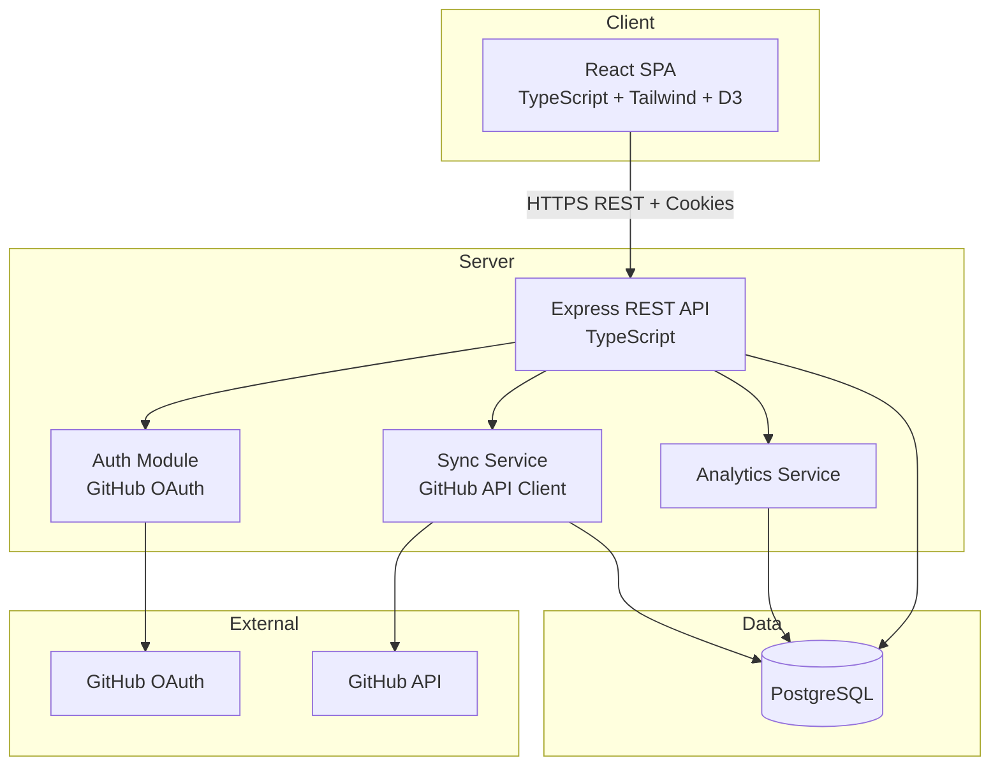
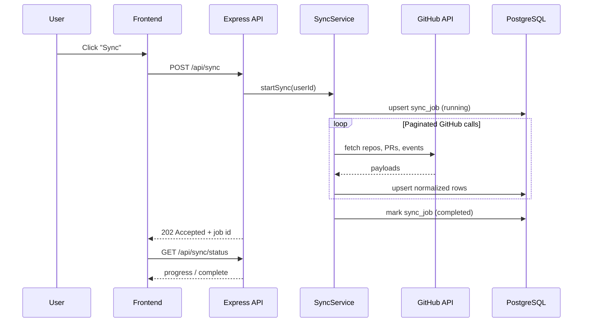

# Architecture Design — Open Source Contribution Tracker

## 1. High-Level System Context



## 2. Architectural Style

**Modular monolith** in a **pnpm/npm workspaces monorepo**:

- One deployable API process (Express)
- One static SPA (Vite + React)
- Shared TypeScript types and validation schemas
- Clear module boundaries inside the API (routes → controllers → services → repositories)

This balances production quality with simplicity for a solo/small team. Microservices are intentionally deferred.

## 3. Clean Architecture Layers (Backend)

```
┌─────────────────────────────────────────────┐
│  Presentation   routes/, middleware/        │
├─────────────────────────────────────────────┤
│  Application    services/ (use cases)       │
├─────────────────────────────────────────────┤
│  Domain         domain/ (entities, rules)   │
├─────────────────────────────────────────────┤
│  Infrastructure db/, github/, auth/         │
└─────────────────────────────────────────────┘
```

**Dependency rule:** Inner layers never import from outer layers. Infrastructure implements interfaces defined in domain/application.

| Layer | Responsibility |
|-------|----------------|
| **Routes** | HTTP mapping, request validation, auth guards |
| **Controllers** | Orchestrate single request; no business logic |
| **Services** | Business rules: sync orchestration, analytics aggregation |
| **Repositories** | SQL queries via parameterized statements (pg) |
| **Domain** | Pure types and invariants |

## 4. Frontend Architecture

```
src/
├── app/           # Router, providers, layout shells
├── features/      # Feature slices (auth, dashboard, journey, repos)
├── components/    # Shared UI (Button, Card, Chart wrappers)
├── hooks/         # Data fetching, auth state
├── lib/           # API client, formatters
├── charts/        # D3 chart components (isolated from React tree churn)
└── types/         # Re-exports from @osct/shared where needed
```

**Patterns:**
- Feature-based folders (colocate components, hooks, API calls)
- React Query (TanStack Query) for server state (Phase 1+)
- Chart components receive normalized data props; D3 logic stays imperative inside `useEffect` + refs

## 5. Data Flow: Sync Pipeline



## 6. API Design (REST)

Base path: `/api/v1`

| Method | Endpoint | Description |
|--------|----------|-------------|
| GET | `/health` | Liveness |
| GET | `/auth/github` | Redirect to GitHub OAuth |
| GET | `/auth/github/callback` | OAuth callback |
| POST | `/auth/logout` | Clear session |
| GET | `/users/me` | Current user profile |
| POST | `/sync` | Trigger contribution sync |
| GET | `/sync/status` | Latest sync job status |
| GET | `/analytics/summary` | Dashboard KPIs |
| GET | `/analytics/contributions` | Time-series data |
| GET | `/analytics/languages` | Language breakdown |
| GET | `/analytics/pull-requests` | PR stats |
| GET | `/journey` | Milestone timeline |
| GET | `/repositories` | User's synced repos |
| GET | `/repositories/:id/insights` | Per-repo analytics |

**Conventions:**
- JSON request/response bodies
- `{ data, meta }` success envelope; `{ error: { code, message } }` for failures
- Pagination: `?page=&limit=` with `meta.total`
- Date filters: ISO 8601 `from` / `to` query params

## 7. Security Model

- **Session:** HTTP-only, Secure, SameSite=Lax cookie with signed session ID
- **OAuth token:** Stored encrypted in DB; never sent to browser
- **CSRF:** SameSite cookies + optional CSRF token for state-changing requests
- **Input validation:** Zod schemas shared via `@osct/shared`
- **SQL:** Parameterized queries only (no string concatenation)

## 8. Deployment Topology (Future)

```
[CDN / Static Host] → React build
        ↓
[Load Balancer] → [Express API] → [PostgreSQL]
                         ↓
                   [Redis] (sessions/jobs, Phase 3+)
```

Environment variables managed via `.env` locally and platform secrets in production.

## 9. Technology Decisions

| Decision | Choice | Rationale |
|----------|--------|-----------|
| Monorepo tool | npm workspaces (or pnpm) | Shared types without publishing |
| API framework | Express | Mature, minimal, well understood |
| DB access | `pg` + repository pattern | Control over SQL; no ORM magic early |
| Migrations | node-pg-migrate or Drizzle Kit | Versioned schema (Phase 1) |
| Frontend build | Vite | Fast DX, native TS |
| Styling | Tailwind CSS | Utility-first, consistent design system |
| Charts | D3.js | Full control for custom OSS analytics visuals |
| Validation | Zod | Runtime + TypeScript inference |
| Testing | Vitest + Supertest | Same ecosystem as Vite |

## 10. Error Handling & GitHub Rate Limits

- Central `GitHubClient` with retry-after header respect
- Exponential backoff on 403/429
- Sync jobs record `rate_limit_reset_at` for UI messaging
- Partial sync allowed: mark repos individually as synced/failed
