# Feature workflows

End-to-end flows for every major OSCT feature. Diagrams use [Mermaid](https://mermaid.js.org/) — they render on GitHub and in most Markdown viewers.

---

## Master journey (issue → first PR)

The core beginner path OSCT is built around — same idea as the RepoSage product flow.

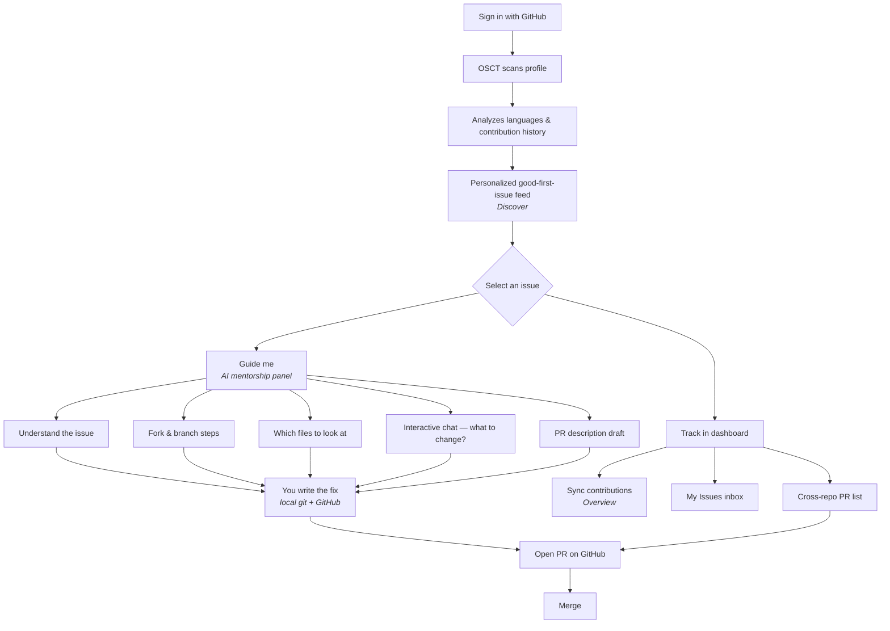
```mermaid
flowchart TD
    A["Sign in with GitHub"] --> B["OSCT scans profile"]
    B --> C["Analyzes languages & contribution history"]
    C --> D["Personalized good-first-issue feed<br/><i>Discover</i>"]

    D --> E{Select an issue}

    E --> F["Guide me<br/><i>AI mentorship panel</i>"]
    F --> F1["Understand the issue"]
    F --> F2["Fork & branch steps"]
    F --> F3["Which files to look at"]
    F --> F4["Interactive chat — what to change?"]
    F --> F5["PR description draft"]
    F1 & F2 & F3 & F4 & F5 --> G["You write the fix<br/><i>local git + GitHub</i>"]

    E --> H["Track in dashboard"]
    H --> H1["Sync contributions<br/><i>Overview</i>"]
    H --> H2["My Issues inbox"]
    H --> H3["Cross-repo PR list"]

    G --> I["Open PR on GitHub"]
    I --> J["Merge"]
    H3 --> I
```

---

## 1. Sign in & session

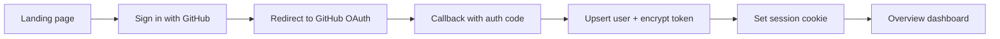
```mermaid
flowchart LR
    A["Landing page"] --> B["Sign in with GitHub"]
    B --> C["Redirect to GitHub OAuth"]
    C --> D["Callback with auth code"]
    D --> E["Upsert user + encrypt token"]
    E --> F["Set session cookie"]
    F --> G["Overview dashboard"]
```

---

## 2. GitHub sync

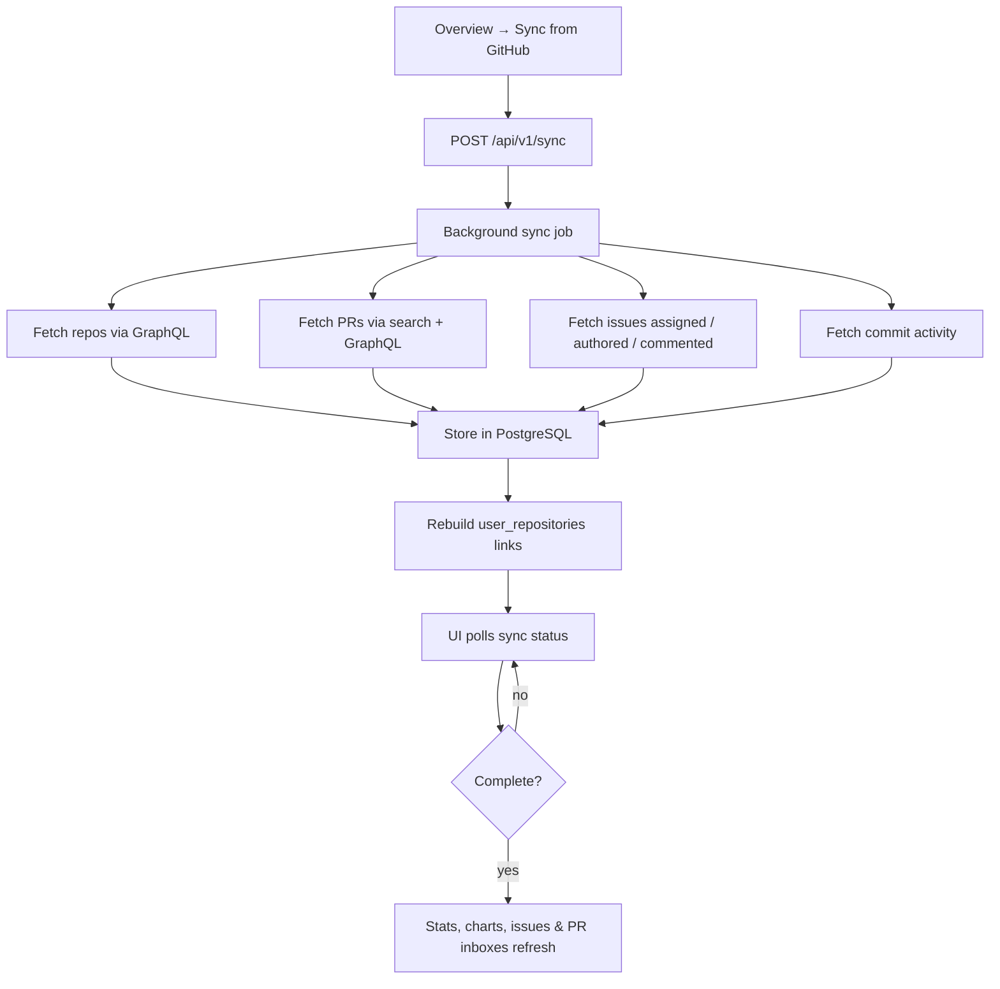
```mermaid
flowchart TD
    A["Overview → Sync from GitHub"] --> B["POST /api/v1/sync"]
    B --> C["Background sync job"]
    C --> D["Fetch repos via GraphQL"]
    C --> E["Fetch PRs via search + GraphQL"]
    C --> F["Fetch issues assigned / authored / commented"]
    C --> G["Fetch commit activity"]
    D & E & F & G --> H["Store in PostgreSQL"]
    H --> I["Rebuild user_repositories links"]
    I --> J["UI polls sync status"]
    J --> K{Complete?}
    K -->|yes| L["Stats, charts, issues & PR inboxes refresh"]
    K -->|no| J
```

---

## 3. Overview dashboard

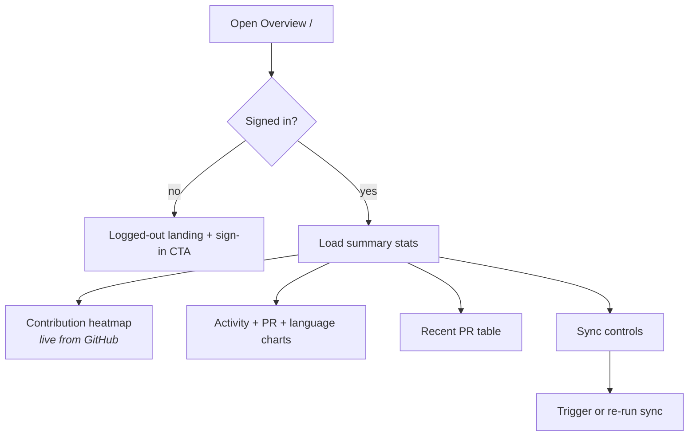
```mermaid
flowchart TD
    A["Open Overview /"] --> B{Signed in?}
    B -->|no| C["Logged-out landing + sign-in CTA"]
    B -->|yes| D["Load summary stats"]
    D --> E["Contribution heatmap<br/><i>live from GitHub</i>"]
    D --> F["Activity + PR + language charts"]
    D --> G["Recent PR table"]
    D --> H["Sync controls"]
    H --> I["Trigger or re-run sync"]
```

---

## 4. Discover — good-first issues

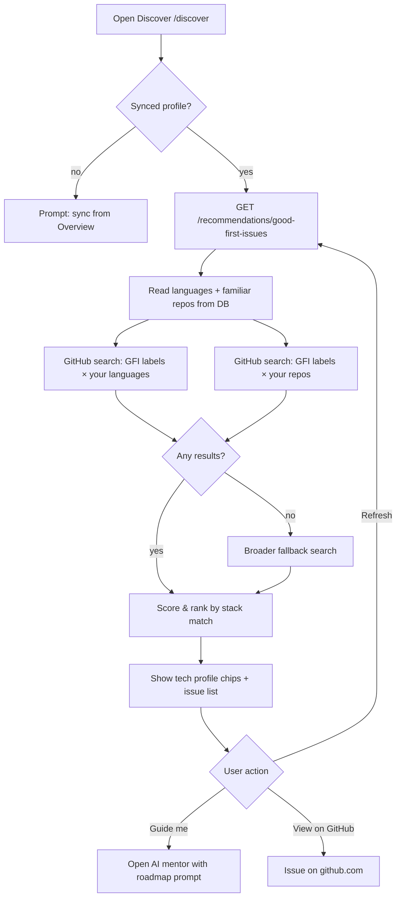
```mermaid
flowchart TD
    A["Open Discover /discover"] --> B{Synced profile?}
    B -->|no| C["Prompt: sync from Overview"]
    B -->|yes| D["GET /recommendations/good-first-issues"]
    D --> E["Read languages + familiar repos from DB"]
    E --> F["GitHub search: GFI labels × your languages"]
    E --> G["GitHub search: GFI labels × your repos"]
    F & G --> H{Any results?}
    H -->|no| I["Broader fallback search"]
    H -->|yes| J["Score & rank by stack match"]
    I --> J
    J --> K["Show tech profile chips + issue list"]
    K --> L{User action}
    L -->|Guide me| M["Open AI mentor with roadmap prompt"]
    L -->|View on GitHub| N["Issue on github.com"]
    L -->|Refresh| D
```

---

## 5. AI mentor (Guide me & agent panel)

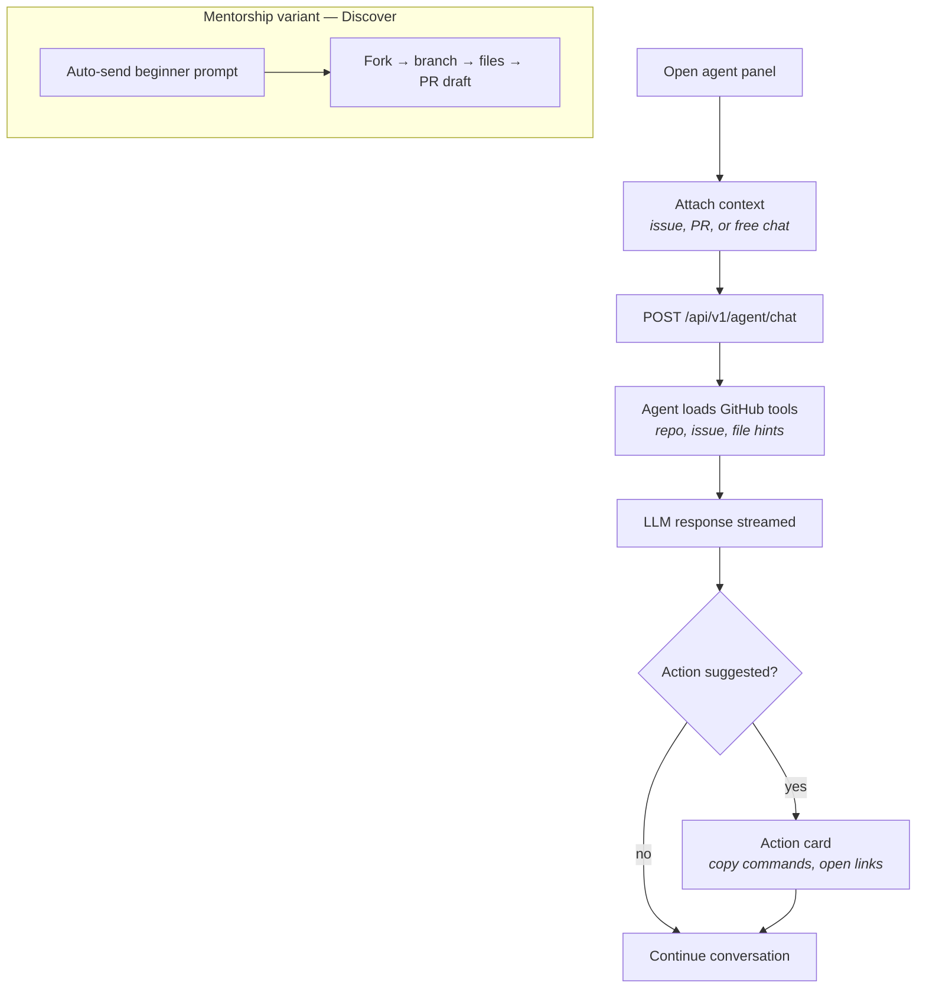
```mermaid
flowchart TD
    A["Open agent panel"] --> B["Attach context<br/><i>issue, PR, or free chat</i>"]
    B --> C["POST /api/v1/agent/chat"]
    C --> D["Agent loads GitHub tools<br/><i>repo, issue, file hints</i>"]
    D --> E["LLM response streamed"]
    E --> F{Action suggested?}
    F -->|yes| G["Action card<br/><i>copy commands, open links</i>"]
    F -->|no| H["Continue conversation"]
    G --> H

    subgraph mentorship ["Mentorship variant — Discover"]
        M1["Auto-send beginner prompt"] --> M2["Fork → branch → files → PR draft"]
    end
```

---

## 6. My Issues

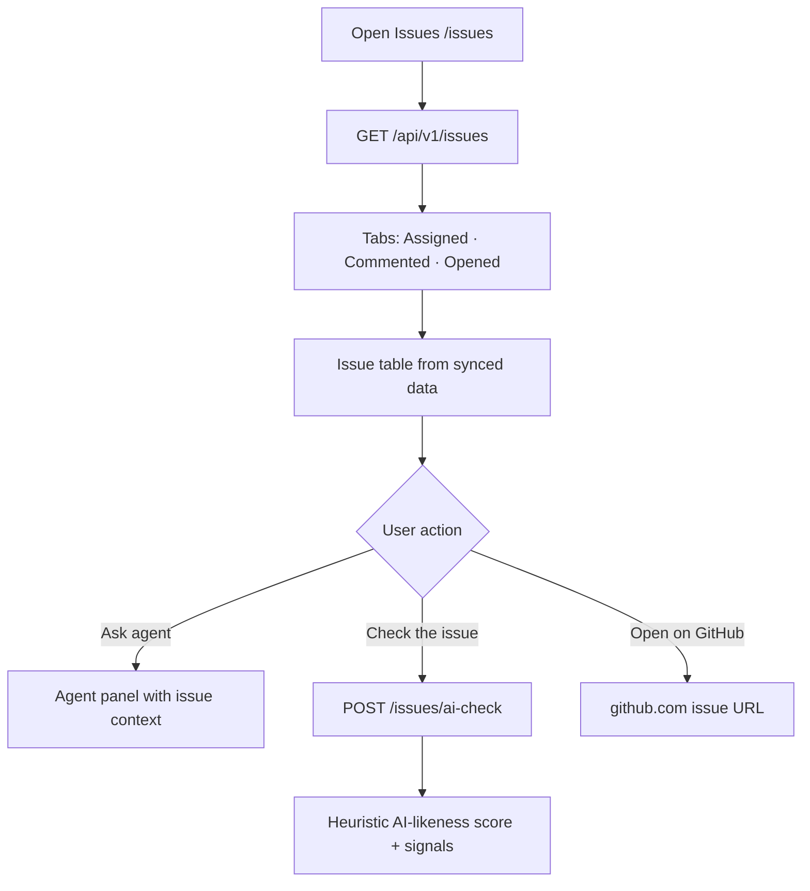
```mermaid
flowchart TD
    A["Open Issues /issues"] --> B["GET /api/v1/issues"]
    B --> C["Tabs: Assigned · Commented · Opened"]
    C --> D["Issue table from synced data"]
    D --> E{User action}
    E -->|Ask agent| F["Agent panel with issue context"]
    E -->|Check the issue| G["POST /issues/ai-check"]
    G --> H["Heuristic AI-likeness score + signals"]
    E -->|Open on GitHub| I["github.com issue URL"]
```

---

## 7. Pull requests inbox

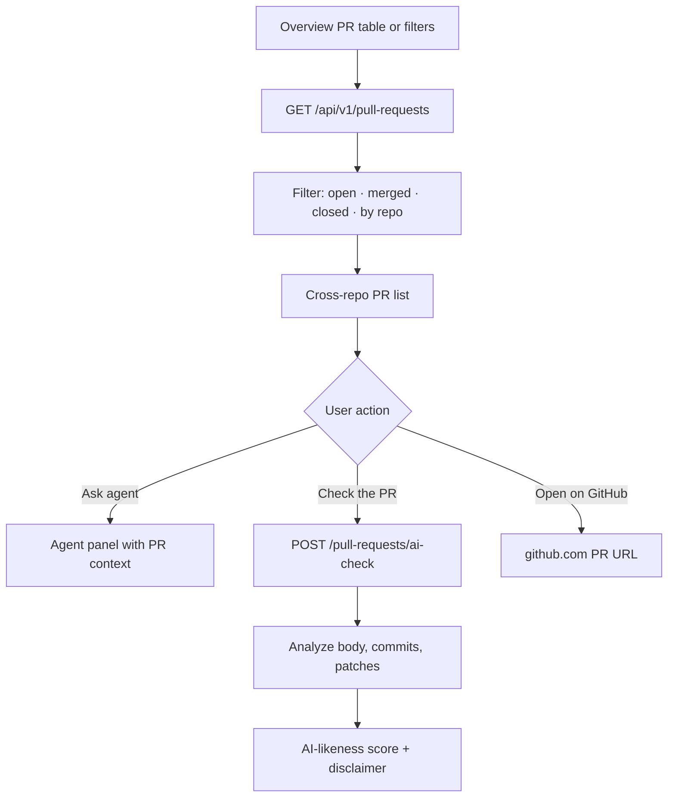
```mermaid
flowchart TD
    A["Overview PR table or filters"] --> B["GET /api/v1/pull-requests"]
    B --> C["Filter: open · merged · closed · by repo"]
    C --> D["Cross-repo PR list"]
    D --> E{User action}
    E -->|Ask agent| F["Agent panel with PR context"]
    E -->|Check the PR| G["POST /pull-requests/ai-check"]
    G --> H["Analyze body, commits, patches"]
    H --> I["AI-likeness score + disclaimer"]
    E -->|Open on GitHub| J["github.com PR URL"]
```

---

## 8. Repositories

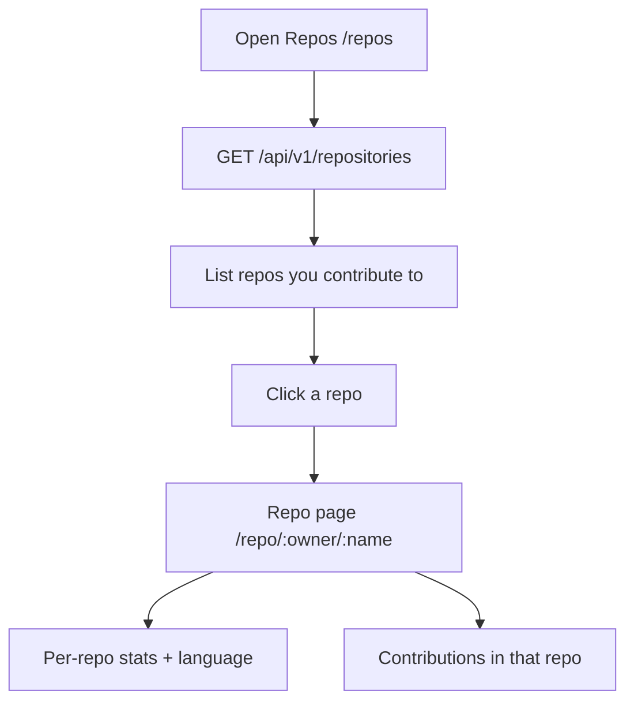
```mermaid
flowchart TD
    A["Open Repos /repos"] --> B["GET /api/v1/repositories"]
    B --> C["List repos you contribute to"]
    C --> D["Click a repo"]
    D --> E["Repo page /repo/:owner/:name"]
    E --> F["Per-repo stats + language"]
    E --> G["Contributions in that repo"]
```

---

## 9. Journey timeline

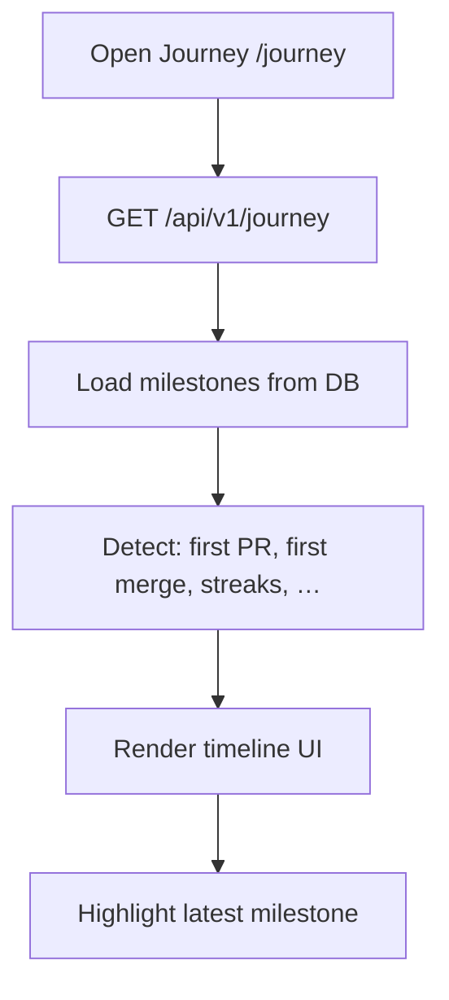
```mermaid
flowchart TD
    A["Open Journey /journey"] --> B["GET /api/v1/journey"]
    B --> C["Load milestones from DB"]
    C --> D["Detect: first PR, first merge, streaks, …"]
    D --> E["Render timeline UI"]
    E --> F["Highlight latest milestone"]
```

---

## 10. Explore (other contributors)

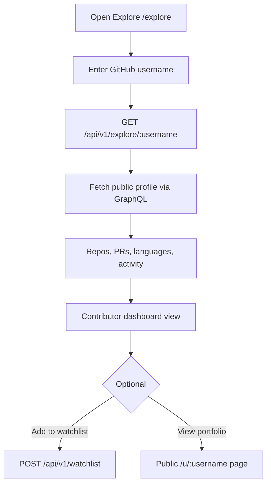
```mermaid
flowchart TD
    A["Open Explore /explore"] --> B["Enter GitHub username"]
    B --> C["GET /api/v1/explore/:username"]
    C --> D["Fetch public profile via GraphQL"]
    D --> E["Repos, PRs, languages, activity"]
    E --> F["Contributor dashboard view"]
    F --> G{Optional}
    G -->|Add to watchlist| H["POST /api/v1/watchlist"]
    G -->|View portfolio| I["Public /u/:username page"]
```

---

## 11. Public portfolio

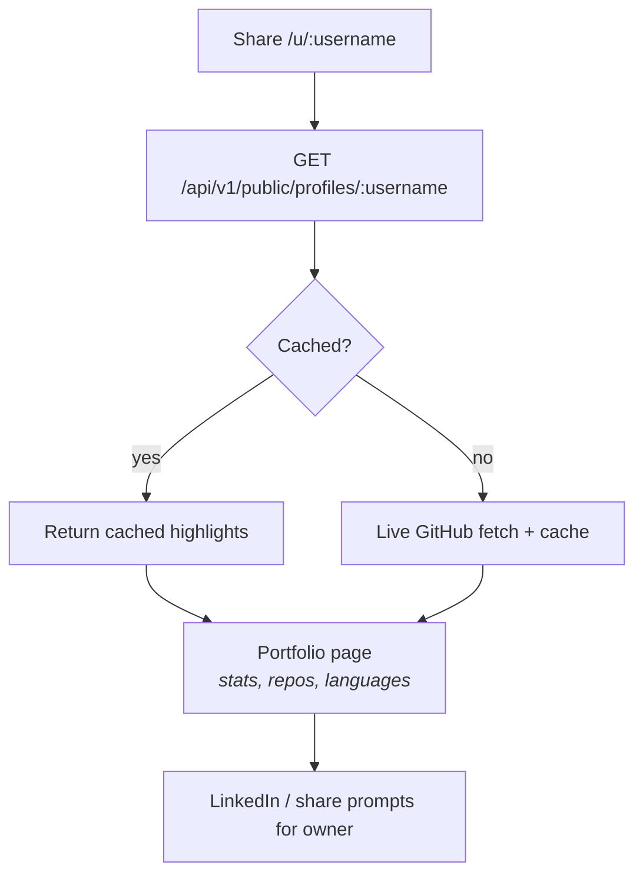
```mermaid
flowchart TD
    A["Share /u/:username"] --> B["GET /api/v1/public/profiles/:username"]
    B --> C{Cached?}
    C -->|yes| D["Return cached highlights"]
    C -->|no| E["Live GitHub fetch + cache"]
    D & E --> F["Portfolio page<br/><i>stats, repos, languages</i>"]
    F --> G["LinkedIn / share prompts for owner"]
```

---

## 12. Weekly digest

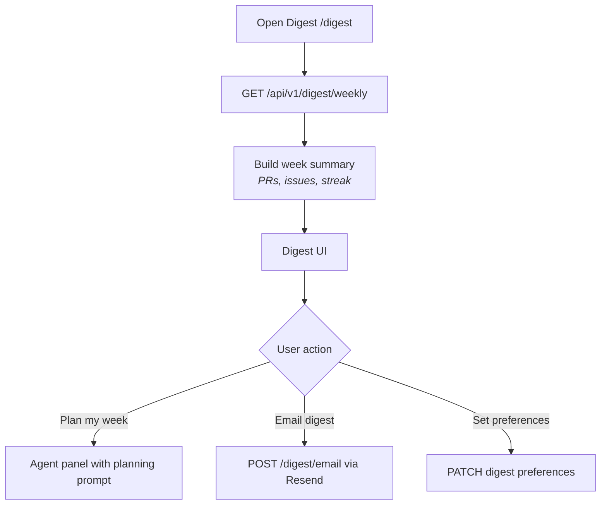
```mermaid
flowchart TD
    A["Open Digest /digest"] --> B["GET /api/v1/digest/weekly"]
    B --> C["Build week summary<br/><i>PRs, issues, streak</i>"]
    C --> D["Digest UI"]
    D --> E{User action}
    E -->|Plan my week| F["Agent panel with planning prompt"]
    E -->|Email digest| G["POST /digest/email via Resend"]
    E -->|Set preferences| H["PATCH digest preferences"]
```

---

## 13. Analytics & heatmap

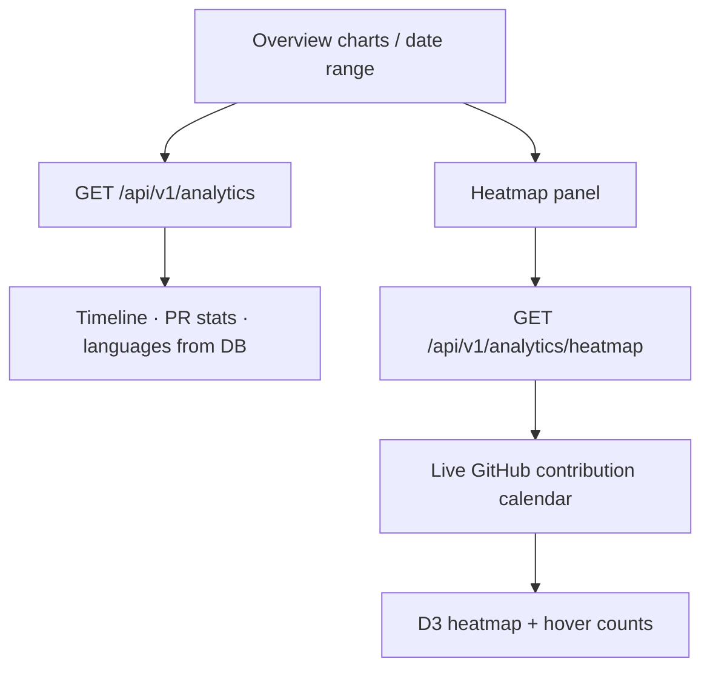
```mermaid
flowchart TD
    A["Overview charts / date range"] --> B["GET /api/v1/analytics"]
    B --> C["Timeline · PR stats · languages from DB"]
    A --> D["Heatmap panel"]
    D --> E["GET /api/v1/analytics/heatmap"]
    E --> F["Live GitHub contribution calendar"]
    F --> G["D3 heatmap + hover counts"]
```

---

## How features connect

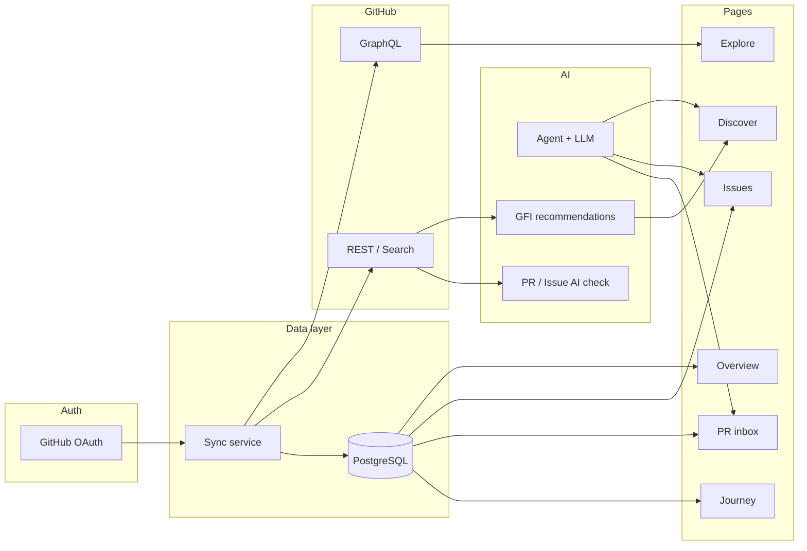
```mermaid
flowchart LR
    subgraph auth ["Auth"]
        OAuth["GitHub OAuth"]
    end

    subgraph data ["Data layer"]
        Sync["Sync service"]
        PG[("PostgreSQL")]
    end

    subgraph github ["GitHub"]
        GQL["GraphQL"]
        REST["REST / Search"]
    end

    subgraph ui ["Pages"]
        OV["Overview"]
        DIS["Discover"]
        ISS["Issues"]
        PR["PR inbox"]
        JOU["Journey"]
        EXP["Explore"]
    end

    subgraph ai ["AI"]
        Agent["Agent + LLM"]
        GFI["GFI recommendations"]
        AICheck["PR / Issue AI check"]
    end

    OAuth --> Sync
    Sync --> GQL & REST
    Sync --> PG
    PG --> OV & ISS & PR & JOU
    REST --> GFI & AICheck
    GFI --> DIS
    Agent --> DIS & ISS & PR
    GQL --> EXP
```

---

## Planned vs shipped

| RepoSage-style step | OSCT today |
|---------------------|------------|
| Personalized issue feed | **Shipped** — Discover |
| AI issue analysis + chat | **Shipped** — Guide me / agent panel |
| Auto architecture diagram | **Not yet** — agent describes in text |
| One-click fork → branch → draft PR | **Partial** — agent gives commands; you run git |
| Kanban board | **Not yet** |
| Track through merge | **Partial** — PR inbox + Journey milestones |
